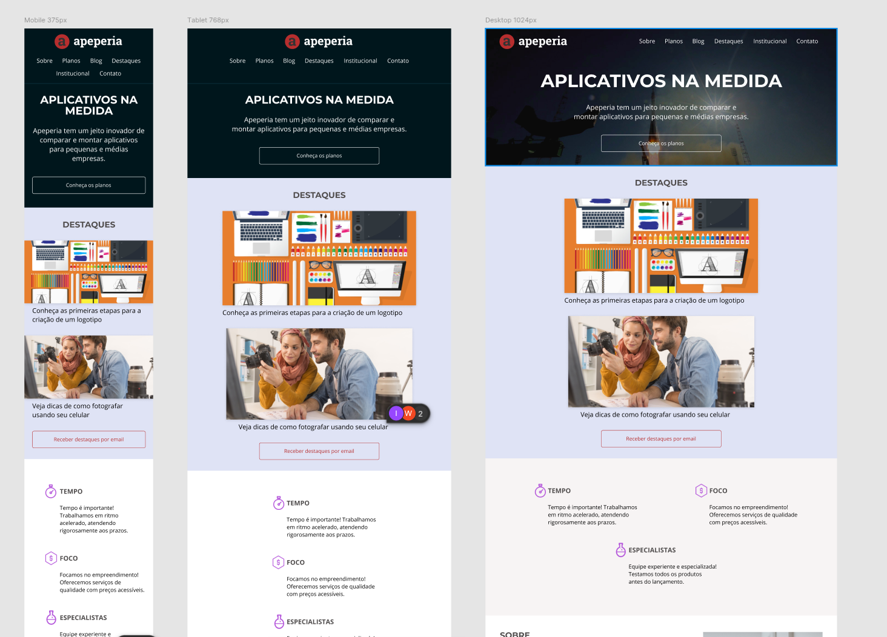

# Apeperia

Uma breve e interessante descrição do seu projeto. O que ele faz? Qual problema ele resolve? Qual é o seu propósito?

## Índice

* [Visão Geral](#visão-geral)
* [Funcionalidades](#funcionalidades)
* [Tecnologias Utilizadas](#tecnologias-utilizadas)
* [Layout](#layout)
* [Como Usar](#como-usar)

---

## Visão Geral

Detalhe um pouco mais sobre o projeto. Por exemplo, "Este é um projeto de [tipo de projeto, ex: uma aplicação web, um script, etc.] que permite [o que o projeto faz]". Você pode adicionar aqui mais contexto sobre o seu objetivo.

## Funcionalidades

Liste as principais funcionalidades ou características do seu projeto. Use uma lista para mantê-las organizadas.

* Funcionalidade 1
* Funcionalidade 2
* Funcionalidade 3

## Tecnologias Utilizadas

Abaixo as principais tecnologias que está sendo utilizada para construir este projeto.

* **Linguagens**: [HTML, CSS] (Mesmo nao sendo linguagem e sim marcação de texto)
* **Ferramentas**: [Git, Figma]
* **Link do Repositório**: [https://github.com/denisiorodrigues/Apperia.git](https://github.com/denisiorodrigues/Apperia.git)

## Layout



[Figma do projeto](https://www.figma.com/design/FidBn9f7BoBCoEs19EzbUD/Apeperia-Mobile-First?node-id=0-1&p=f&t=DmUFb444lsZkSio5-0)

## Como Usar

1.  **Clone o repositório:**
    ```bash
    git clone https://github.com/denisiorodrigues/Apperia.git
    ```
2.  **Navegue até a pasta do projeto:**
    ```bash
    cd apperia
    ```
3. **Execute a aplicação:**

    Instalar a extenção **Live Server** no VS Code ou clicar no arquivo index.html 

